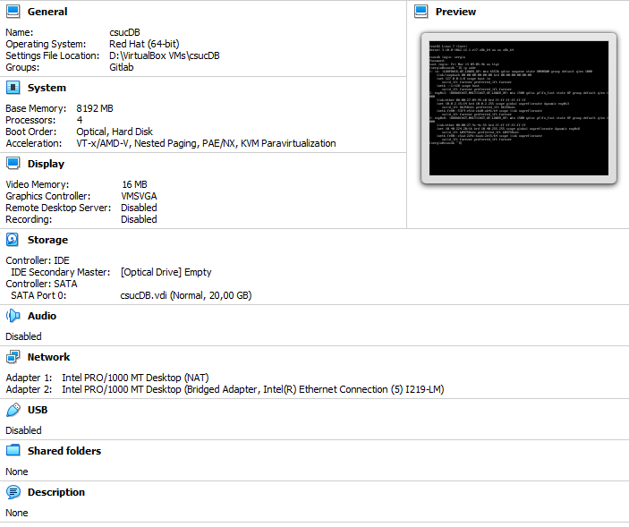
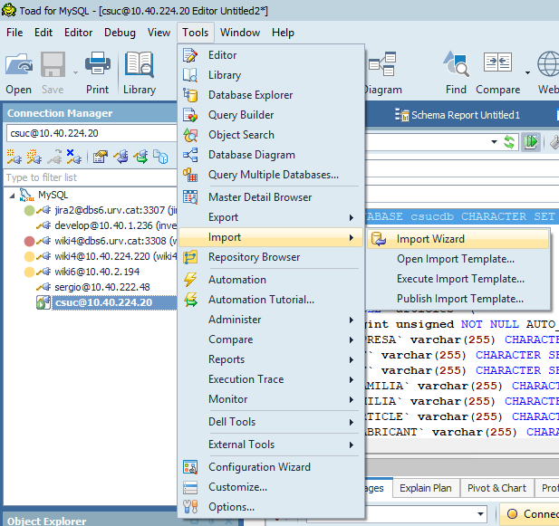
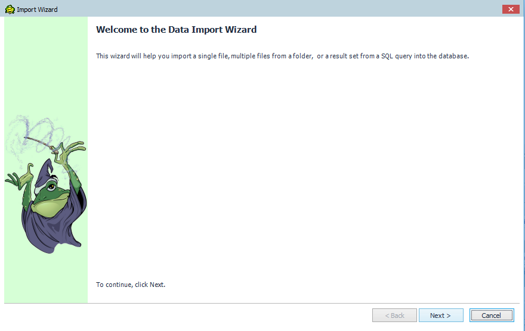
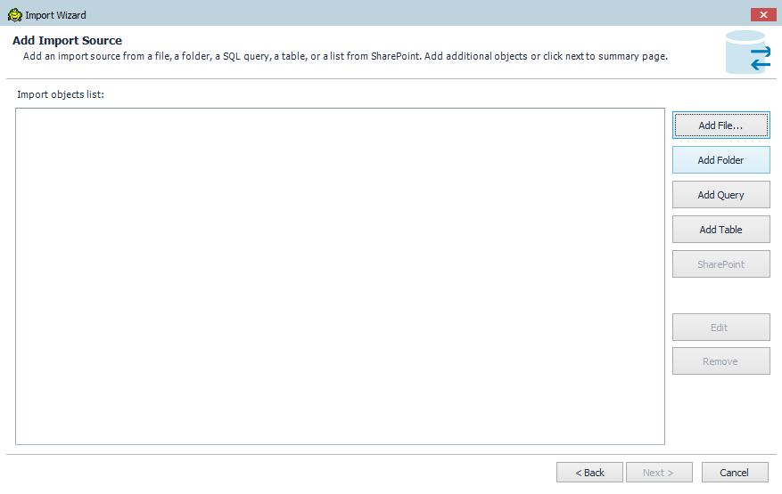
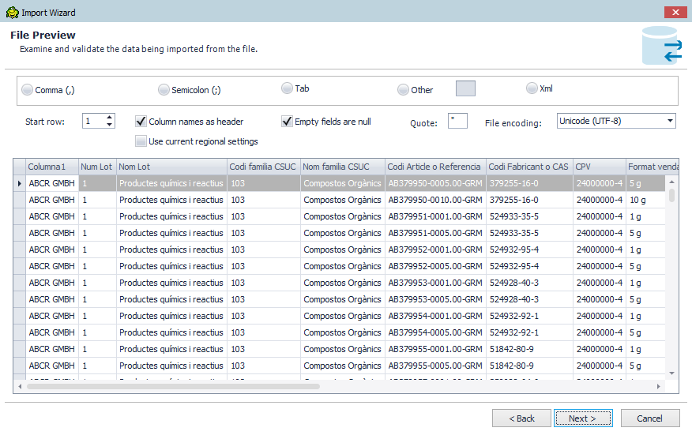
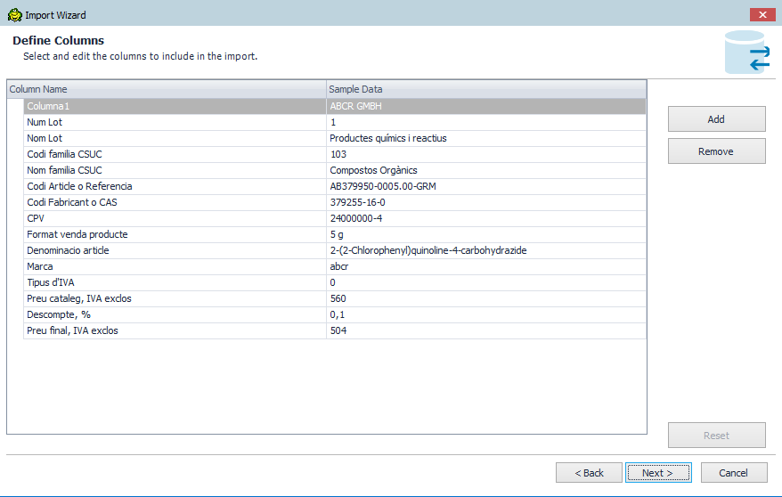
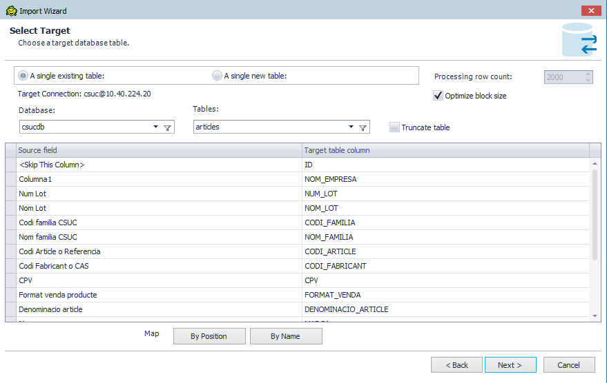
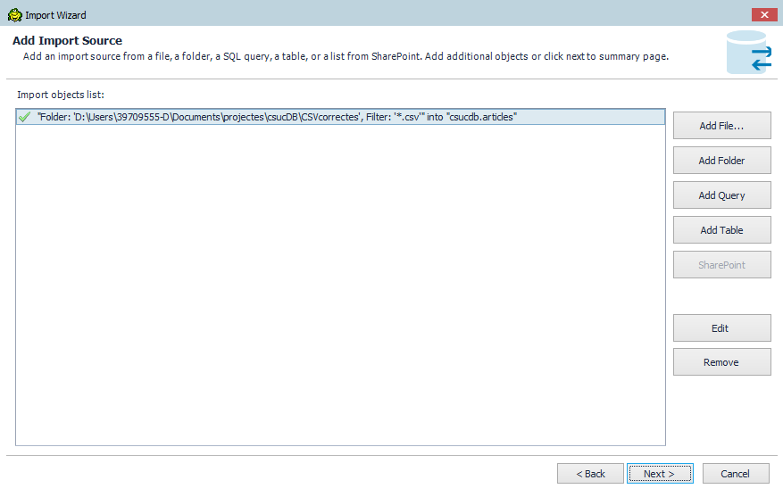
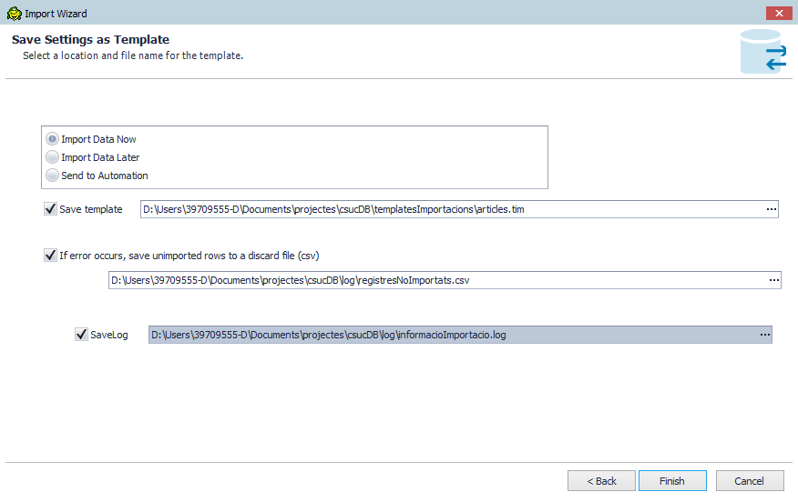
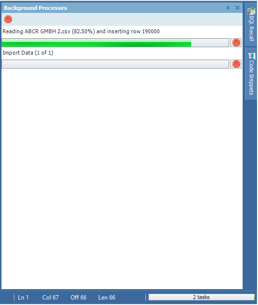

# Aplicació material de laboratori

### Descripció de l'entorn de servidor




#### SISTEMA OPERATIU
```bash
[sergio@csucdb ~]$ lsb_release -a
-bash: lsb_release: no se encontró la orden
[sergio@csucdb ~]$ hostnamectl
   Static hostname: csucdb
         Icon name: computer-vm
           Chassis: vm
        Machine ID: 1036a84977304120a5d98c7e4fe43c93
           Boot ID: 2684be13825e47ffb6b13783ce510476
    Virtualization: kvm
  Operating System: CentOS Linux 7 (Core)
       CPE OS Name: cpe:/o:centos:centos:7
            Kernel: Linux 3.10.0-1062.12.1.el7.x86_64
      Architecture: x86-64
[sergio@csucdb ~]$ uname -r
3.10.0-1062.12.1.el7.x86_64
```

#### APACHE
```bash
[sergio@csucdb ~]$ httpd -version
Server version: Apache/2.4.6 (CentOS)
Server built:   Aug  8 2019 11:41:18
```

#### MySQL
```bash
[sergio@csucdb ~]$ mysql --version
mysql  Ver 8.0.19 for Linux on x86_64 (MySQL Community Server - GPL)
```

#### PHP
```bash
[sergio@csucdb ~]$ php -version
PHP 7.3.15 (cli) (built: Feb 18 2020 09:25:23) ( NTS )
Copyright (c) 1997-2018 The PHP Group
Zend Engine v3.3.15, Copyright (c) 1998-2018 Zend Technologies
    with Zend OPcache v7.3.15, Copyright (c) 1999-2018, by Zend Technologies
```

### Configuració específica per MySQL
```bash
/etc/my.cnf
; InnoDB buffer pool size in bytes. The primary value to adjust on a database server,
; can be set up to 80% of the total memory in these environments
innodb_buffer_pool_size = 6000M
;  If innodb_buffer_pool_size is set to more than 1GB, innodb_buffer_pool_instances
; divides the InnoDB buffer pool into this many instances.
innodb_buffer_pool_instances = 12
```

#### Llibreries
*	Datatables 1.10.20: https://datatables.net/. Llicència MIT per ús lliure i open source. [Llicència MIT](https://choosealicense.com/licenses/mit/)
* Jquery 3.4.1
*	Bootstrap 4.3.1
*	Jquery-ui 1.12.1

*Totes les llibreries estan incloses al repositori, per tant totes les referencies son locals. Les quatre llibreries tenen [Llícència MIT](https://choosealicense.com/licenses/mit/)*


#### Model de dades MySQL
```SQL
CREATE DATABASE csucdb CHARACTER SET utf8 COLLATE utf8_unicode_ci;

USE csucdb;

CREATE TABLE `articles` (
  `ID` bigint unsigned NOT NULL AUTO_INCREMENT,
  `NOM_EMPRESA` varchar(255) CHARACTER SET utf8 COLLATE utf8_unicode_ci DEFAULT NULL,
  `NUM_LOT` varchar(255) CHARACTER SET utf8 COLLATE utf8_unicode_ci DEFAULT NULL,
  `NOM_LOT` varchar(255) CHARACTER SET latin1 COLLATE latin1_swedish_ci DEFAULT NULL,
  `CODI_FAMILIA` varchar(255) CHARACTER SET utf8 COLLATE utf8_unicode_ci DEFAULT NULL,
  `NOM_FAMILIA` varchar(255) CHARACTER SET utf8 COLLATE utf8_unicode_ci DEFAULT NULL,
  `CODI_ARTICLE` varchar(255) CHARACTER SET utf8 COLLATE utf8_unicode_ci DEFAULT NULL,
  `CODI_FABRICANT` varchar(255) CHARACTER SET utf8 COLLATE utf8_unicode_ci DEFAULT NULL,
  `CPV` varchar(255) CHARACTER SET utf8 COLLATE utf8_unicode_ci DEFAULT NULL,
  `FORMAT_VENDA` varchar(255) CHARACTER SET utf8 COLLATE utf8_unicode_ci DEFAULT NULL,
  `DENOMINACIO_ARTICLE` varchar(1024) CHARACTER SET utf8 COLLATE utf8_unicode_ci DEFAULT NULL,
  `MARCA` varchar(255) CHARACTER SET utf8 COLLATE utf8_unicode_ci DEFAULT NULL,
  `TIPUS_IVA` varchar(255) CHARACTER SET utf8 COLLATE utf8_unicode_ci DEFAULT NULL,
  `PREU_CATALEG` varchar(255) CHARACTER SET utf8 COLLATE utf8_unicode_ci DEFAULT NULL,
  `DESCOMPTE` varchar(255) CHARACTER SET utf8 COLLATE utf8_unicode_ci DEFAULT NULL,
  `PREU_FINAL` varchar(255) CHARACTER SET utf8 COLLATE utf8_unicode_ci DEFAULT NULL,
  PRIMARY KEY (`ID`),
  KEY `idx_articles_NOM_EMPRESA` (`NOM_EMPRESA`),
  KEY `idx_articles_NUM_LOT` (`NUM_LOT`),
  KEY `idx_articles_NOM_LOT` (`NOM_LOT`),
  KEY `idx_articles_CODI_FAMILIA` (`CODI_FAMILIA`),
  KEY `idx_articles_NOM_FAMILIA` (`NOM_FAMILIA`),
  KEY `idx_articles_CODI_ARTICLE` (`CODI_ARTICLE`),
  KEY `idx_articles_CODI_FABRICANT` (`CODI_FABRICANT`),
  KEY `idx_articles_CPV` (`CPV`),
  KEY `idx_articles_FORMAT_VENDA` (`FORMAT_VENDA`),
  KEY `idx_articles_DENOMINACIO_ARTICLE` (`DENOMINACIO_ARTICLE`),
  KEY `idx_articles_MARCA` (`MARCA`),
  KEY `idx_articles_TIPUS_IVA` (`TIPUS_IVA`),
  KEY `idx_articles_PREU_CATALEG` (`PREU_CATALEG`),
  KEY `idx_articles_DESCOMPTE` (`DESCOMPTE`),
  KEY `idx_articles_PREU_FINAL` (`PREU_FINAL`)
) ENGINE=InnoDB AUTO_INCREMENT=1646473 DEFAULT CHARSET=utf8 COLLATE=utf8_unicode_ci;

CREATE TABLE `statistics_lot` (
  `num_lot` varchar(128) COLLATE utf8_unicode_ci NOT NULL,
  `num_records` int DEFAULT NULL,
  `percent_of_total` decimal(5,2) DEFAULT NULL,
  PRIMARY KEY (`num_lot`)
) ENGINE=InnoDB DEFAULT CHARSET=utf8 COLLATE=utf8_unicode_ci
```

### Procés d'importació de fitxers .csv





#### Add folder


Especificar la ubicació dels fitxers .csv a importar


Els arxius han de tenir el mateix nombre de columnes i la mateixa codificació de caràcters.





Escollir taula de destinació creada prèviament i mapejar les columnes dels CSV als camps de la taula.
Observació: el camp ID no te columna associada, com és un “autoincrement” l’omplirà de forma automàtica.


Es poden afegir més importacions. No és necessari.




En tocar a la part de tasques (baix de tot a la dreta) podem veure per on va la importació.



### Log d'events després d'importar
Arxiu informacióImportacio.log especificat en l’assistent d’importació. A les ´´ultimes línies es pot veure el nombre de registres importats i el temps invertit en la importació.


#### Registres no importats

Els registres no importats queden guardats a l’arxiu registresNoImportats.csv especificat en l’assistent d’importació.
